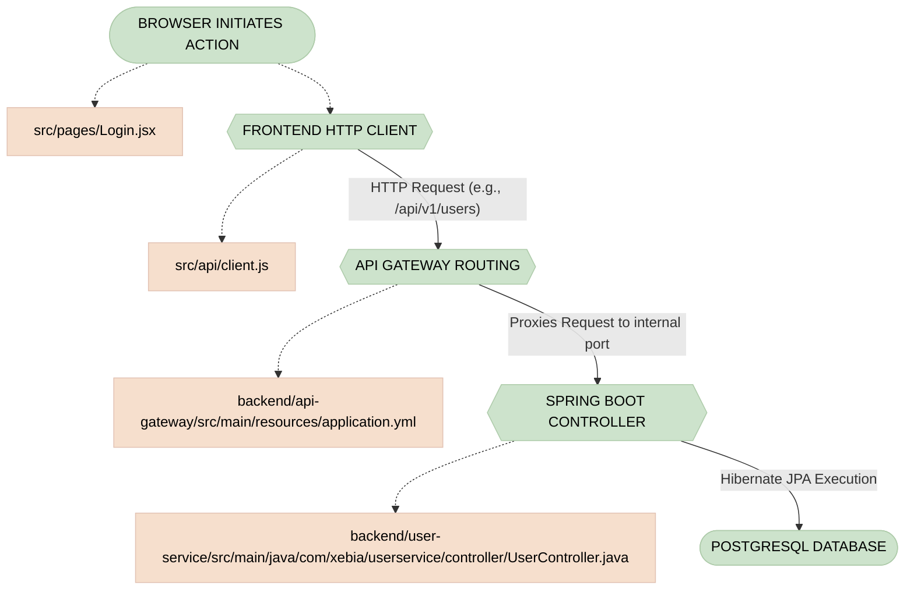
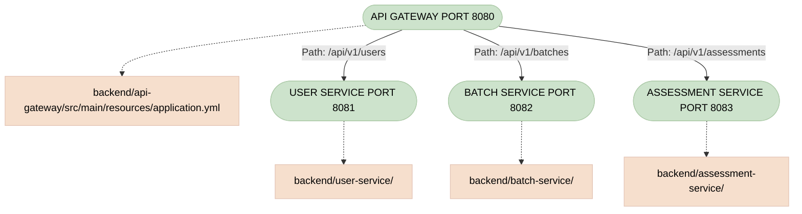
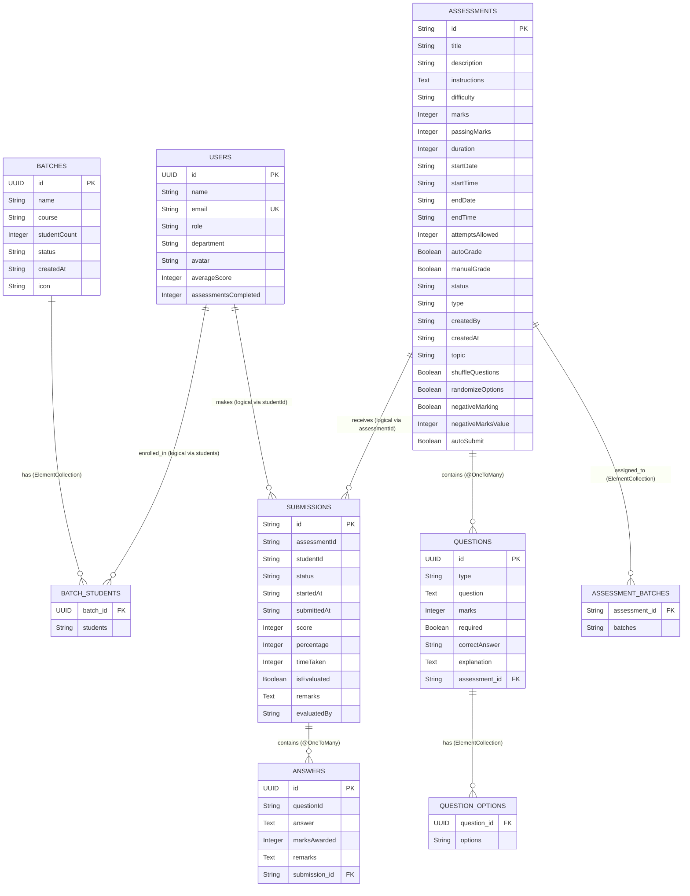
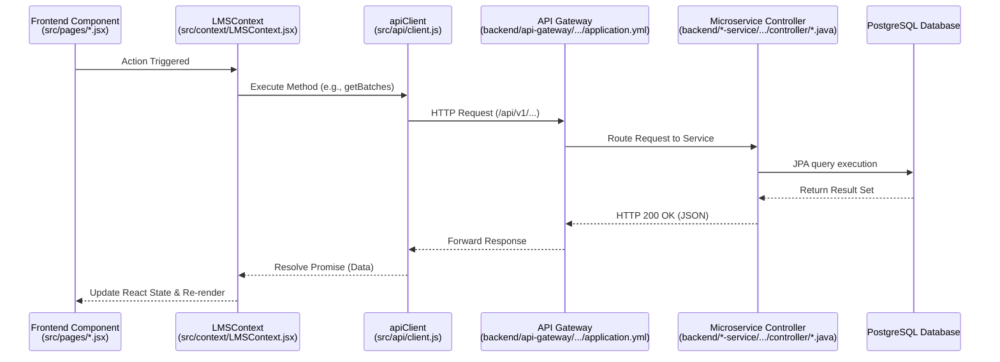
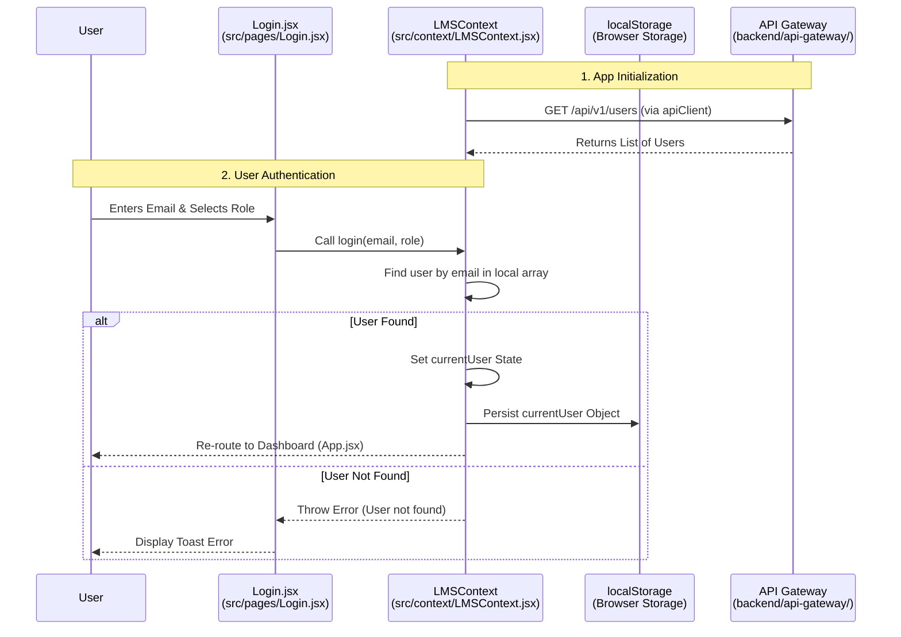
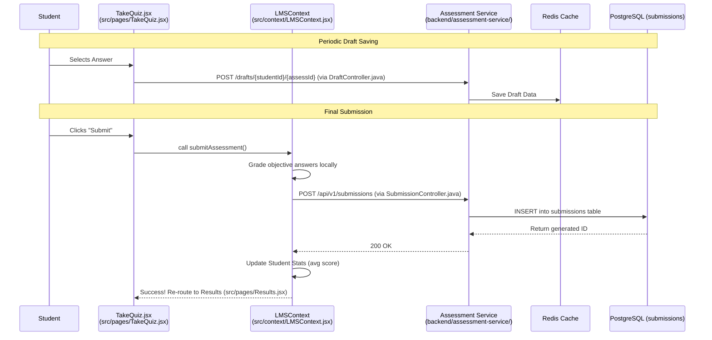

# System Technical Documentation

## Table of Contents
1. [Project Overview & Architecture](#project-overview--architecture)
2. [Backend Implementation](#backend-implementation)
3. [Frontend Implementation](#frontend-implementation)
4. [API Specifications](#api-specifications)
5. [Feature Documentation](#feature-documentation)
6. [Database Structure](#database-structure)
7. [Execution Flows](#execution-flows)
8. [Configuration & Deployment](#configuration--deployment)

---

<a id="project-overview--architecture"></a>
## 1. Project Overview, Structure & Architecture
## 1. Project Overview

### Purpose
An AI-powered assessment platform designed for Students and Trainers to facilitate the creation, management, and submission of educational assessments, while managing users and student batches.

### Technologies Used
- **Java 21:** Primary language for backend microservices.
- **JavaScript (JSX):** Primary language for the frontend.
- **PostgreSQL:** Relational database for persistent data storage.
- **Redis:** In-memory data store for caching/session management.
- **Groq AI:** Integrated for AI-assisted features.

### Frameworks
- **Frontend:** React 18, React Router DOM, Tailwind CSS (for styling).
- **Backend:** Spring Boot (v4.1.0) and Spring Cloud (v2025.1.2) for a microservices architecture.

### Build Tools
- **Frontend:** Vite (configured via `vite.config.js`) and NPM (`package.json`).
- **Backend:** Maven wrapper (`mvnw`) across all microservices.

---

## 2. Project Structure

### Full Folder Tree (Core Architecture)
```text
C:\Users\HP\Documents\Xebia-Intern\STUDENT portal\Xebia-Student-Trainer
├── backend/
│   ├── api-gateway/
│   ├── assessment-service/
│   ├── batch-service/
│   └── user-service/
├── public/
└── src/
    ├── api/
    ├── components/
    ├── context/
    ├── pages/
    └── utils/
```

### Explanation of Each Folder & Responsibilities

- **`backend/`**
  Houses the Java Spring Boot microservices that drive application logic and database interaction.
  - **`api-gateway/`**: Uses `spring-cloud-starter-gateway-server-webmvc` to act as the single entry point, routing requests to the appropriate microservice.
  - **`user-service/`**: Responsible for user management (Trainers and Students), authentication, and profiles. 
  - **`batch-service/`**: Manages cohorts/batches of students and their enrollment.
  - **`assessment-service/`**: Handles core assessment logic, including tests, questions, options, and student submissions.

- **`src/`**
  Contains the entire React frontend source code.
  - **`api/`**: Utility functions/wrappers for making HTTP requests to the API Gateway.
  - **`components/`**: Reusable React UI components (e.g., buttons, cards, modals).
  - **`context/`**: React Context providers for managing global application state.
  - **`pages/`**: Top-level route components mapped to URLs via React Router.
  - **`utils/`**: Helper functions and common logic.

- **`public/`**
  Contains static assets like raw HTML (`index.html`) served directly to the browser.

---

## 3. Identify

- **Frontend:** A Single Page Application (SPA) located at `src/`, initialized through `index.html` and bundled using Vite.
- **Backend:** A distributed microservices architecture located at `backend/`, orchestrated via the `start_backend.ps1` script.
- **Database Usage:** 
  - **PostgreSQL** is utilized heavily across the backend. Connections are established using the `org.postgresql:postgresql` JDBC driver, configured inside the `src/main/resources/application.yml` file of each microservice. Schema definitions are generated via Hibernate JPA (`ddl-auto: update`).
  - **Redis** is referenced in the backend infrastructure for caching/rate-limiting.

---

## 4. System & Component Architecture

### System Architecture
The system is a distributed web application consisting of a React-based SPA communicating with a Java Spring Boot microservices backend through an API Gateway. Data persistence is handled by a single PostgreSQL database.

### Component Architecture
- **Frontend Components:** Pages map to routes, Context manages global state, and the API Client acts as a centralized request dispatcher.
- **Backend Microservices:** The API Gateway proxies `/api/v1/*` requests. The `user-service`, `batch-service`, and `assessment-service` independently process domain-specific logic.

### Module Interactions
- The **Frontend** only interacts with the **API Gateway** (port 8080).
- The **API Gateway** inspects the URL path to determine module interaction:
  - `/api/v1/users/**` -> **User Service** (8081).
  - `/api/v1/batches/**` -> **Batch Service** (8082).
  - `/api/v1/assessments/**` & `/api/v1/questions/**` -> **Assessment Service** (8083).
- Microservices appear isolated, interacting solely with their respective PostgreSQL tables generated by Hibernate.

---

## 5. Data Flow Diagrams

### A. High-Level Data Flow: Request Lifecycle



### B. Component Diagram: API Gateway Routing Rules




---

<a id="backend-implementation"></a>
## 2. Backend Implementation
### Architecture
The backend uses a **Java Spring Boot** microservices architecture. 
- **Microservices:** Divided into domain-driven services (`user-service`, `batch-service`, `assessment-service`).
- **Data Access:** Relies on **Spring Data JPA** (Hibernate) mapping to a PostgreSQL database.
- **Routing:** Handled via Spring Cloud Gateway (`api-gateway`).
- **Dependencies & Build:** Managed via Maven wrapper (`mvnw`) utilizing Java 21.

---

### Package Structure
The standard package layout across all microservices follows a strict layered architecture pattern. Using `com.xebia.{servicename}` as the root:
- `controller/`: Contains `@RestController` classes exposing HTTP endpoints.
- `service/`: Contains `@Service` classes holding business logic and acting as intermediaries.
- `repository/`: Contains Spring Data `JpaRepository` interfaces for database interactions.
- `model/`: Contains JPA `@Entity` classes representing database tables.

*(Note: `assessment-service` also includes a `config/` directory containing `RedisConfig.java` for caching integrations).*

---

### Controllers

### UserController
- **File path:** `backend/user-service/src/main/java/com/xebia/userservice/controller/UserController.java`
- **Dependencies:** `UserService`
- **Endpoints:**
  - `GET /api/v1/users` 
    - *Request:* Optional query param `?role={role}`
    - *Response:* `List<User>`
  - `POST /api/v1/users`
    - *Request:* JSON Body `User`
    - *Response:* `User` (Created record)

### BatchController
- **File path:** `backend/batch-service/src/main/java/com/xebia/batchservice/controller/BatchController.java`
- **Dependencies:** `BatchService`
- **Endpoints:**
  - `GET /api/v1/batches` → Returns `List<Batch>`
  - `POST /api/v1/batches` → Accepts JSON `Batch`, Returns `Batch`
  - `PUT /api/v1/batches/{id}` → Accepts JSON `Batch`, Returns updated `ResponseEntity<Batch>`
  - `DELETE /api/v1/batches/{id}` → Returns `ResponseEntity<Void>`

### AssessmentController
- **File path:** `backend/assessment-service/src/main/java/com/xebia/assessmentservice/controller/AssessmentController.java`
- **Dependencies:** `AssessmentService`
- **Endpoints:** Provides identical standard CRUD mappings mapped to `/api/v1/assessments`.

---

### Services

### UserService
- **File path:** `backend/user-service/src/main/java/com/xebia/userservice/service/UserService.java`
- **Dependencies:** `UserRepository`
- **Business Logic:** Primarily acts as a passthrough to the repository.
- **Methods:**
  - `getAllUsers()` → `userRepository.findAll()`
  - `getUsersByRole(String role)` → `userRepository.findByRole(role)`
  - `createUser(User user)` → `userRepository.save(user)`

### BatchService
- **File path:** `backend/batch-service/src/main/java/com/xebia/batchservice/service/BatchService.java`
- **Dependencies:** `BatchRepository`
- **Business Logic:** The `updateBatch` method fetches the existing `Batch` via `findById(id)`. If present, it executes conditional null checks (`if (updated.getName() != null)`) to selectively update fields before saving, preserving existing data.
- **Methods:** `getAllBatches()`, `createBatch()`, `updateBatch()`, `deleteBatch()`.

---

### Repositories / Data Access

### UserRepository
- **File path:** `backend/user-service/src/main/java/com/xebia/userservice/repository/UserRepository.java`
- **Relationships:** Extends `JpaRepository<User, String>`
- **Queries:** Defines custom finder method `List<User> findByRole(String role);`

### BatchRepository
- **File path:** `backend/batch-service/src/main/java/com/xebia/batchservice/repository/BatchRepository.java`
- **Relationships:** Extends `JpaRepository<Batch, String>`
- **Queries:** Inherits all standard Spring Data JPA methods. No custom queries are currently defined.

---

### Entities / Models

### User Entity
- **File path:** `backend/user-service/src/main/java/com/xebia/userservice/model/User.java`
- **Configuration:** `@Entity`, `@Table(name = "users")`. Uses Lombok (`@Data`, `@NoArgsConstructor`, `@AllArgsConstructor`).
- **Fields:**
  - `id`: `String` (Generated via `GenerationType.UUID`)
  - `name`: `String`
  - `email`: `String` (`@Column(unique = true)`)
  - `role`: `String` ("teacher" or "student")
  - `department`, `avatar`: `String`
  - `averageScore`, `assessmentsCompleted`: `Integer`

### Batch Entity
- **File path:** `backend/batch-service/src/main/java/com/xebia/batchservice/model/Batch.java`
- **Configuration:** `@Entity`, `@Table(name = "batches")`. Uses Lombok.
- **Fields:**
  - `id`: `String` (UUID Generated)
  - `name`, `course`, `status`, `createdAt`, `icon`: `String`
  - `studentCount`: `Integer`
  - `students`: `List<String>` (Annotated with `@ElementCollection` to automatically map to a separate relational table `batch_students`).


---

<a id="frontend-implementation"></a>
## 3. Frontend Implementation
### Folder Structure
The `src/` directory is logically partitioned into domain-specific folders:
- **`api/`**: Contains the centralized HTTP client (`client.js`) interfacing with the backend gateway.
- **`components/`**: Contains reusable UI elements (`Header.jsx`, `Sidebar.jsx`, `Toast.jsx`) and complex modular views (e.g., `assessment-builder/`).
- **`context/`**: Contains global state management logic via React Context (`LMSContext.jsx`).
- **`pages/`**: Contains top-level view components mapping 1:1 with specific application routes (e.g., `Login.jsx`, `TeacherDashboard.jsx`, `TakeQuiz.jsx`).
- **`utils/`**: Houses utility scripts and external integrations (e.g., `aiService.js`).

---

### Routing
Routing is implemented in `src/App.jsx` using `react-router-dom` (`BrowserRouter`, `Routes`, `Route`).
- **Authentication Guard:** If `currentUser` is null, the app exclusively renders the `<Login />` component.
- **Role-Based Routing:** The `AppContent` wrapper inspects `currentUser.role` to render distinct routing trees:
  - **Teacher:** Accesses `/trainer-dashboard`, `/batches`, `/assessment-builder`, `/evaluation`, etc.
  - **Student:** Accesses `/student-dashboard`, `/assessments`, `/take/:slug`, `/results/:slug/:id`, etc.
- **Dynamic UI:** If the URL path indicates an active test (e.g., `/take/` or `/take-coding/`), standard navigational elements (Sidebar, Header) are hidden to enforce focus.

---

### State Management
State is centrally managed without external libraries (like Redux) using the React Context API.
- **Provider:** `<LMSProvider>` defined in `src/context/LMSContext.jsx` wraps the entire application.
- **Hydration:** On mount, an empty `useEffect` triggers asynchronous data fetching (`getUsers`, `getBatches`, `getAssessments`) via `apiClient` to populate global states.
- **Persistence:** High-frequency states (e.g., `currentUser`, `theme`, `codingSubmissions`) are aggressively synced to `localStorage` via multiple `useEffect` hooks to survive page reloads.

---

### Services / API Calls
API calls are abstracted out of component files and centralized into a service object.
- **`src/api/client.js`**: Exports an `apiClient` object utilizing the native browser `fetch` API.
  - All requests prefix the URI with `/api/v1` (which the Vite proxy/API Gateway intercepts).
  - Handles JSON serialization natively before transmission.
  - Exposes dedicated methods for entity operations (e.g., `createBatch()`, `getSubmissions()`, `saveDraft()`).

---

### Important Components Analysis

### A. App / AppContent (`src/App.jsx`)
- **Purpose:** The root structural component handling URL-to-Component mapping and responsive layout wrappers (Sidebar/Header injections).
- **File path:** `src/App.jsx`
- **Hooks:** `useState` (for Sidebar toggles), `useLocation` (for route tracking), `useLMS` (to consume global state).
- **State:** `isMobileSidebarOpen`, `isDesktopSidebarCollapsed`, `toasts`.
- **Rendering behavior:** Conditionally mounts the Sidebar/Header depending on viewport size and the current route (hiding them during assessments). Uses `motion.div` (`framer-motion`) for page transition animations.

### B. LMSContext (`src/context/LMSContext.jsx`)
- **Purpose:** Acts as the central data store and business logic orchestrator for the entire application.
- **File path:** `src/context/LMSContext.jsx`
- **Hooks:** `createContext`, `useContext`, `useState`, `useEffect`.
- **State:** Extremely heavy state container holding `teachers`, `students`, `batches`, `assessments`, `submissions`, `currentUser`, and localized `notifications`.
- **API usage:** Heavily utilizes `apiClient`. For example, `createBatch` in the Context calls `apiClient.createBatch`, then locally mutates the `batches` state array to reflect the new data instantly across the app.
- **Rendering behavior:** Does not render UI; strictly provides state and modifier functions to children via `value={{...}}`.

### C. apiClient (`src/api/client.js`)
- **Purpose:** Abstracts all backend REST communication into a single interface.
- **File path:** `src/api/client.js`
- **API usage:** Implements standard HTTP verbs (`GET`, `POST`, `PUT`, `DELETE`). Also handles complex payload transformations, such as stringifying JSON arrays within submission answers before sending them to the backend in `createSubmission()`.


---

<a id="api-specifications"></a>
## 4. API Specifications
### User Service APIs

#### 1. Retrieve Users
- **Method:** `GET`
- **URL:** `/api/v1/users` (Optional Query Param: `?role=`)
- **Controller:** `backend/user-service/src/main/java/com/xebia/userservice/controller/UserController.java`
- **Service Used:** `UserService`
- **Request Body:** None
- **Response:** `List<User>` (JSON Array)
- **Status Codes:** `200 OK`
- **Database Interaction:** Executes `userRepository.findAll()` or `userRepository.findByRole(role)`.
- **Execution Flow:** API Gateway routing → `UserController.getAllUsers()` → `UserService` → `UserRepository` → PostgreSQL `users` table.

#### 2. Create User
- **Method:** `POST`
- **URL:** `/api/v1/users`
- **Controller:** `backend/user-service/src/main/java/com/xebia/userservice/controller/UserController.java`
- **Service Used:** `UserService`
- **Request Body:** `User` JSON object
- **Response:** `User` JSON object (with generated UUID)
- **Status Codes:** `200 OK`
- **Database Interaction:** Executes `userRepository.save(user)`.
- **Execution Flow:** API Gateway routing → `UserController.createUser()` → `UserService.createUser()` → `UserRepository.save()` → PostgreSQL `users` table.

---

### Batch Service APIs

#### 3. Retrieve Batches
- **Method:** `GET`
- **URL:** `/api/v1/batches`
- **Controller:** `backend/batch-service/src/main/java/com/xebia/batchservice/controller/BatchController.java`
- **Service Used:** `BatchService`
- **Request Body:** None
- **Response:** `List<Batch>` (JSON Array)
- **Status Codes:** `200 OK`
- **Database Interaction:** `batchRepository.findAll()`
- **Execution Flow:** Gateway → `BatchController.getAllBatches()` → `BatchService.getAllBatches()` → DB.

#### 4. Create Batch
- **Method:** `POST`
- **URL:** `/api/v1/batches`
- **Controller:** `backend/batch-service/src/main/java/com/xebia/batchservice/controller/BatchController.java`
- **Service Used:** `BatchService`
- **Request Body:** `Batch` JSON object
- **Response:** `Batch` JSON object (with generated UUID)
- **Status Codes:** `200 OK`
- **Database Interaction:** `batchRepository.save(batch)`
- **Execution Flow:** Gateway → `BatchController.createBatch()` → `BatchService.createBatch()` → DB.

#### 5. Update Batch
- **Method:** `PUT`
- **URL:** `/api/v1/batches/{id}`
- **Controller:** `backend/batch-service/src/main/java/com/xebia/batchservice/controller/BatchController.java`
- **Service Used:** `BatchService`
- **Request Body:** `Batch` JSON object
- **Response:** `Batch` JSON object (Updated record)
- **Status Codes:** `200 OK`
- **Database Interaction:** Fetches via `findById(id)`, modifies fields conditionally in memory, saves via `save(batch)`.
- **Execution Flow:** Gateway → `BatchController.updateBatch()` → `BatchService.updateBatch()` → DB.

#### 6. Delete Batch
- **Method:** `DELETE`
- **URL:** `/api/v1/batches/{id}`
- **Controller:** `backend/batch-service/src/main/java/com/xebia/batchservice/controller/BatchController.java`
- **Service Used:** `BatchService`
- **Request Body:** None
- **Response:** Empty Body
- **Status Codes:** `204 No Content`
- **Database Interaction:** `batchRepository.deleteById(id)`
- **Execution Flow:** Gateway → `BatchController.deleteBatch()` → `BatchService.deleteBatch()` → returns `ResponseEntity.noContent()`.

---

### Assessment Service APIs

#### 7. Retrieve Assessments
- **Method:** `GET`
- **URL:** `/api/v1/assessments`
- **Controller:** `backend/assessment-service/src/main/java/com/xebia/assessmentservice/controller/AssessmentController.java`
- **Service Used:** `AssessmentService`
- **Request Body:** None
- **Response:** `List<Assessment>` (JSON Array)
- **Status Codes:** `200 OK`
- **Database Interaction:** `assessmentRepository.findAll()`

#### 8. Create / Update / Delete Assessments
*(Behaves identically to Batch Service logic structure across `POST /api/v1/assessments`, `PUT /api/v1/assessments/{id}`, and `DELETE /api/v1/assessments/{id}`).*

---

### Submission & Draft APIs (Assessment Service)

#### 9. Retrieve Submissions
- **Method:** `GET`
- **URL:** `/api/v1/submissions` (Optional Query Param: `?studentId=`)
- **Controller:** `backend/assessment-service/src/main/java/com/xebia/assessmentservice/controller/SubmissionController.java`
- **Service Used:** `SubmissionService`
- **Request Body:** None
- **Response:** `List<Submission>`
- **Status Codes:** `200 OK`
- **Database Interaction:** `submissionRepository.findAll()` or `findByStudentId()`

#### 10. Create Submission
- **Method:** `POST`
- **URL:** `/api/v1/submissions`
- **Controller:** `backend/assessment-service/src/main/java/com/xebia/assessmentservice/controller/SubmissionController.java`
- **Service Used:** `SubmissionService`
- **Request Body:** `Submission` JSON object
- **Response:** `Submission` JSON object
- **Status Codes:** `200 OK`
- **Database Interaction:** `submissionRepository.save(submission)`

#### 11. Save Assessment Draft
- **Method:** `POST`
- **URL:** `/api/v1/assessments/drafts/{studentId}/{assessmentId}`
- **Controller:** `backend/assessment-service/src/main/java/com/xebia/assessmentservice/controller/DraftController.java`
- **Service Used:** `AssessmentCacheService`
- **Request Body:** `Map<String, Object>` draftData JSON
- **Response:** None
- **Status Codes:** `200 OK`
- **Database Interaction:** **None.** Uses Spring Cache/Redis templates (`cacheService.saveDraft()`).
- **Execution Flow:** Gateway → `DraftController.saveDraft()` → `AssessmentCacheService` → Redis Cluster.

#### 12. Get Assessment Draft
- **Method:** `GET`
- **URL:** `/api/v1/assessments/drafts/{studentId}/{assessmentId}`
- **Controller:** `backend/assessment-service/src/main/java/com/xebia/assessmentservice/controller/DraftController.java`
- **Service Used:** `AssessmentCacheService`
- **Request Body:** None
- **Response:** JSON Object (draft data) or null
- **Status Codes:** `200 OK`
- **Database Interaction:** **None.** Fetched from Redis.

---

### AI APIs (Assessment Service)

#### 13. Generate Assessment Description (AI)
- **Method:** `POST`
- **URL:** `/api/v1/assessments/ai/generate-description`
- **Controller:** `backend/assessment-service/src/main/java/com/xebia/assessmentservice/controller/AIController.java`
- **Service Used:** `AIService`
- **Request Body:** `Map<String, String>` containing `{"topic": "..."}`
- **Response:** `Map<String, String>` containing `{"content": "..."}`
- **Status Codes:** `200 OK`
- **Database Interaction:** **None.** 
- **Execution Flow:** Gateway → `AIController.generateDescription()` → `AIService.generateAssessmentDescription()` → Calls external LLM API synchronously → Returns wrapped JSON map.


---

<a id="feature-documentation"></a>
## 5. Feature Documentation
### Simulated Role-Based Authentication
**Purpose:** Authenticate users by verifying their email against the pre-loaded backend user lists and directing them to the appropriate dashboard based on their role (`teacher` or `student`).

**Files Involved:**
- `src/App.jsx`
- `src/pages/Login.jsx`
- `src/context/LMSContext.jsx`
- `backend/user-service/src/main/java/com/xebia/userservice/controller/UserController.java`

**Frontend Components:**
- `<Login />`
- `<AppContent />`

**Backend Components:**
- `UserController` (`GET /api/v1/users`)

**Flow Description:**
1. On app load, `LMSContext` fetches all users from the backend via `GET /api/v1/users` and partitions them into `teachers` and `students` states.
2. The user enters an email in `Login.jsx` and clicks "Sign in".
3. `LMSContext.login()` scans the pre-loaded arrays. If matched, it sets the `currentUser` and re-routes to the proper dashboard.

---

### Batch Management
**Purpose:** Allows Trainers to create, view, update, and manage cohorts of students (Batches).

**Files Involved:**
- `src/pages/BatchManagement.jsx`
- `src/pages/BatchDetail.jsx`
- `src/context/LMSContext.jsx`
- `src/api/client.js`
- `backend/batch-service/src/main/java/com/xebia/batchservice/controller/BatchController.java`

**Flow Description:**
1. A trainer submits a new batch via the frontend.
2. `LMSContext.createBatch()` triggers `apiClient.createBatch()`.
3. The API Gateway routes `POST /api/v1/batches` to the Batch Service which persists the entity in PostgreSQL.

---

### Assessment Builder with AI Assistance
**Purpose:** Enables Trainers to create comprehensive assessments and utilize an AI endpoint to auto-generate topic descriptions.

**Files Involved:**
- `src/pages/AssessmentBuilder.jsx`
- `src/components/assessment-builder/ConfigPanel.jsx`
- `src/components/assessment-builder/QuestionBuilderPanel.jsx`
- `backend/assessment-service/src/main/java/com/xebia/assessmentservice/controller/AssessmentController.java`
- `backend/assessment-service/src/main/java/com/xebia/assessmentservice/controller/AIController.java`

**Flow Description:**
1. Trainer clicks "Generate via AI". Frontend sends `POST /api/v1/assessments/ai/generate-description`.
2. The `AIController` intercepts this, passing it to `AIService` to generate content via a 3rd party LLM API.
3. Trainer publishes the assessment. `apiClient.createAssessment()` POSTs the JSON structure to `/api/v1/assessments` for database persistence.

---

### Assessment Taking & Progress Persistence (Drafts)
**Purpose:** Enables students to take assessments with their progress saved continuously in-memory via Redis.

**Files Involved:**
- `src/pages/TakeQuiz.jsx`
- `src/pages/TakeCoding.jsx`
- `src/api/client.js`
- `backend/assessment-service/src/main/java/com/xebia/assessmentservice/controller/DraftController.java`
- `backend/assessment-service/src/main/java/com/xebia/assessmentservice/controller/SubmissionController.java`

**Flow Description:**
1. A student navigates to `<TakeQuiz />`. As they select answers, `apiClient.saveDraft()` fires periodically.
2. The `DraftController` stores the draft in Redis.
3. Upon clicking "Submit", the frontend grades the objective questions and fires `POST /api/v1/submissions` to save the final payload in PostgreSQL.

---

### Automated Leaderboard & Statistics
**Purpose:** Dynamically generate a ranked leaderboard based on student scores.

**Files Involved:**
- `src/pages/Leaderboard.jsx`
- `src/context/LMSContext.jsx`

**Flow Description:**
When `<Leaderboard />` is mounted, it calls `LMSContext.getLeaderboard()`. The frontend cross-references the `students` array and `submissions` array, mathematically scoring and sorting users into a ranked list rendered on screen.

---

### Manual & AI Submission Evaluation (Grading)
**Purpose:** Allows trainers to review pending submissions, manually adjust marks, provide remarks, or utilize AI to auto-evaluate descriptive answers.

**Files Involved:**
- `src/pages/Evaluation.jsx`
- `src/utils/aiService.js`
- `src/context/LMSContext.jsx`

**Frontend Components:**
- `<Evaluation />`

**APIs Used:**
- `aiService.evaluateSubmission` (Client-side AI call wrapper)

**Flow Description:**
1. Trainer navigates to Evaluation and selects a pending submission.
2. The UI renders the student's answers versus the expected answers.
3. The Trainer can click "Auto Evaluation Using AI", which invokes `aiService.evaluateSubmission()` iteratively over each question to suggest marks.
4. Trainer clicks "Publish Evaluation", executing `LMSContext.evaluateSubmission()` to finalize the score and dispatch an in-app notification to the student.

---

### Reports & Analytics Dashboard
**Purpose:** Visualizes batch-wide and LMS-wide performance metrics (Pass/Fail rates, Score Distributions) using charts.

**Files Involved:**
- `src/pages/Reports.jsx`
- `src/context/LMSContext.jsx`

**Frontend Components:**
- `<Reports />`
- `Recharts` library components (`BarChart`, `PieChart`)

**Flow Description:**
1. The component extracts all `submissions` where `isEvaluated` is true.
2. It calculates aggregations: Average LMS score, Pass Rate (>60%), Fail Rate.
3. It maps `batches` against their enrolled students' average scores to feed the `BarChart`.
4. It categorizes all scores into brackets (Excellent, Above Avg, etc.) to feed the `PieChart` and renders a filterable diagnostic table of all students.

---

### Settings & Profile Management
**Purpose:** Allows users (both trainers and students) to update their personal details, change avatars, reset passwords, and configure notification preferences.

**Files Involved:**
- `src/pages/Settings.jsx`
- `src/context/LMSContext.jsx`

**Frontend Components:**
- `<Settings />`

**Flow Description:**
1. Renders a tabbed interface (Profile, Security, Notifications).
2. Users can upload an image (processed locally via HTML5 `Canvas` to crop/compress into a base64 Data URL) or select a preset avatar.
3. Upon clicking "Save Profile", `LMSContext.updateProfile()` mutates the global `currentUser` state and syncs to `localStorage` (Note: Backend sync for profile edits is currently handled entirely in local state in the provided logic).


---

<a id="database-structure"></a>
## 6. Database Structure
### Entity Relationship (ER) Diagram



---

### Tables & Usage Details

#### 1. Table: `users`
- **File Location:** `backend/user-service/src/main/java/com/xebia/userservice/model/User.java`
- **Keys:** `id` (PK, UUID generated)
- **Columns:** 
  - `name`, `role`, `department`, `avatar` (VARCHAR)
  - `email` (VARCHAR, Unique Constraint)
  - `averageScore`, `assessmentsCompleted` (INTEGER)
- **Relationships:** None defined explicitly at DB level.
- **Usage in Code:** Fetched during app initialization to simulate authentication, partition dashboards by `role`, and calculate Leaderboard rankings using the stat integer columns.

#### 2. Table: `batches`
- **File Location:** `backend/batch-service/src/main/java/com/xebia/batchservice/model/Batch.java`
- **Keys:** `id` (PK, UUID generated)
- **Columns:** `name`, `course`, `studentCount`, `status`, `createdAt`, `icon`
- **Relationships:** 
  - Generates secondary table `batch_students` (via `@ElementCollection`) storing a list of Student string IDs attached to a `batch_id`.
- **Usage in Code:** Grouping students logically. Filtered in `Reports.jsx` to show cohort-wide analytics.

#### 3. Table: `assessments`
- **File Location:** `backend/assessment-service/src/main/java/com/xebia/assessmentservice/model/Assessment.java`
- **Keys:** `id` (PK, Custom String provided by frontend)
- **Columns:** Heavy configuration table. Contains 24 distinct columns managing metadata, scheduling (`startDate`, `duration`), and rule-sets (`shuffleQuestions`, `negativeMarking`, `autoGrade`).
- **Relationships:**
  - `assessment_batches` (Secondary table via `@ElementCollection` tracking which batches can take it).
  - `@OneToMany` to `questions` (Generates an implicit `assessment_id` FK inside the `questions` table).
- **Usage in Code:** The core entity managed in `AssessmentBuilder.jsx`. Pulled into memory to render the test-taking UI.

#### 4. Table: `questions`
- **File Location:** `backend/assessment-service/src/main/java/com/xebia/assessmentservice/model/Question.java`
- **Keys:** `id` (PK, UUID generated)
- **Columns:** `type`, `question` (TEXT), `marks`, `required`, `correctAnswer`, `explanation` (TEXT), `assessment_id` (FK assigned by parent).
- **Relationships:** 
  - `question_options` (Secondary table via `@ElementCollection` storing array of multiple choice options).
  - Belongs to `assessments`.
- **Usage in Code:** Rendered dynamically inside `<TakeQuiz />`. `correctAnswer` is utilized in `LMSContext.jsx` for local auto-grading.

#### 5. Table: `submissions`
- **File Location:** `backend/assessment-service/src/main/java/com/xebia/assessmentservice/model/Submission.java`
- **Keys:** `id` (PK, Custom String)
- **Columns:** `assessmentId` (Logical FK), `studentId` (Logical FK), `status`, `startedAt`, `submittedAt`, `score`, `percentage`, `timeTaken`, `isEvaluated`, `remarks` (TEXT), `evaluatedBy`
- **Relationships:** 
  - `@OneToMany` to `answers` (Generates an implicit `submission_id` FK inside the `answers` table).
- **Usage in Code:** Saved when a student finishes an assessment. Later retrieved by trainers in `Evaluation.jsx` to review and grade pending attempts.

#### 6. Table: `answers`
- **File Location:** `backend/assessment-service/src/main/java/com/xebia/assessmentservice/model/Answer.java`
- **Keys:** `id` (PK, UUID generated)
- **Columns:** `questionId` (Logical FK to questions table), `answer` (TEXT), `marksAwarded`, `remarks` (TEXT), `submission_id` (FK assigned by parent).
- **Relationships:** Belongs to `submissions`.
- **Usage in Code:** Records exactly what the student typed or selected for a specific question, alongside marks given by the AI or the Trainer.


---

<a id="execution-flows"></a>
## 7. Execution Flows
### General Request Lifecycle & API Flow

This flow dictates how standard data (like fetching batches or saving an assessment) traverses the full stack.

1. **Frontend Trigger:** A user interaction in a React Component (e.g., `src/pages/BatchManagement.jsx`) triggers a function in `LMSContext` (`src/context/LMSContext.jsx`).
2. **HTTP Client:** `LMSContext` delegates the network call to `src/api/client.js` (`apiClient`), which executes a native `fetch()` to `/api/v1/{resource}`.
3. **API Gateway Routing:** The request hits the Spring Cloud Gateway configured in `backend/api-gateway/src/main/resources/application.yml` (port 8080). The gateway matches the URI path and routes it to the specific downstream microservice (e.g., `batch-service`).
4. **Controller:** The respective Spring Boot `@RestController` (e.g., `backend/batch-service/src/main/java/com/xebia/batchservice/controller/BatchController.java`) intercepts the HTTP request, deserializes the JSON body, and passes it to the `@Service` layer.
5. **Service & Repository:** The `@Service` (e.g., `BatchService.java`) contains business logic and delegates data persistence to the Spring Data JPA `@Repository` (e.g., `BatchRepository.java`).
6. **Database:** The repository executes the SQL statement against the PostgreSQL database (or Redis if it's a draft) and returns the data entity back up the chain.



---

### Simulated Authentication Flow

Because there is no backend authentication logic explicitly defined in the provided code, the authentication flow happens entirely on the client side.

1. **Hydration:** When the frontend boots up, `src/context/LMSContext.jsx` immediately fetches all known users from `GET /api/v1/users` via `src/api/client.js`.
2. **Login Attempt:** A user enters an email address in `src/pages/Login.jsx` and clicks "Sign in as Trainer" or "Sign in as Student".
3. **Validation:** `LMSContext.login()` executes an `Array.find()` on the pre-loaded users array to match the provided email.
4. **State Commitment:** If a match is found, the user object is set to the `currentUser` state variable and redundantly saved to browser `localStorage`.
5. **Route Unlock:** The `<AppContent />` wrapper in `src/App.jsx` observes the `currentUser` state change and dynamically mounts the protected routes.



---

### Data Flow: Assessment Submission & Auto-Grading

This flow describes what happens when a student takes a test and submits it. It involves draft caching, local evaluation, and final persistence.

1. **Drafts (In-Progress):** As a student selects options in `src/pages/TakeQuiz.jsx`, `apiClient.saveDraft()` (`src/api/client.js`) is called periodically.
2. **Redis Caching:** The `backend/assessment-service/.../controller/DraftController.java` intercepts this and stores the draft `Map` into Redis.
3. **Submission Trigger:** The student clicks "Submit" in `TakeQuiz.jsx`.
4. **Local Auto-Grading:** `LMSContext.submitAssessment()` in `src/context/LMSContext.jsx` intercepts the submission. It cross-references the student's answers with the assessment's expected `correctAnswer` in memory, mutating the answer payload to include `marksAwarded`.
5. **Persistence:** The graded payload is POSTed to `apiClient.createSubmission()`.
6. **Database Save:** `backend/assessment-service/.../controller/SubmissionController.java` receives it and persists the final graded entity into the `submissions` PostgreSQL table.
7. **Stat Updates:** Synchronously, `LMSContext.jsx` increments the student's `assessmentsCompleted` and recalculates their `averageScore` to reflect immediately on `src/pages/Leaderboard.jsx`.




---

<a id="configuration--deployment"></a>
## 8. Configuration & Deployment
### Frontend Configuration

### Build Tools & Frameworks
- **Framework:** React 19 (managed via Vite)
- **Bundler / Dev Server:** Vite (`vite: ^6.2.3`)
- **Styling:** TailwindCSS 4 (`@tailwindcss/vite: ^4.1.14`)
- **Commands:** Defined in `package.json`:
  - `npm run dev`: Starts the Vite server on `http://0.0.0.0:3000`.
  - `npm run build`: Bundles the app for production via `vite build`.
  - `npm run preview`: Locally previews the production build.

### Environment Variables
Located in `C:\Users\HP\Documents\Xebia-Intern\STUDENT portal\Xebia-Student-Trainer\.env`:
```env
VITE_GROQ_API_KEY="gsk_..." # Used in src/utils/aiService.js for external LLM API calls
```

### Local Development Proxy (`vite.config.js`)
During local development, the Vite server (`localhost:3000`) is configured to intercept `/api/v1/*` requests and proxy them directly to the backend microservices, bypassing the API Gateway to prevent CORS issues locally.
- `/api/v1/users` → proxied to `http://localhost:8081`
- `/api/v1/batches` → proxied to `http://localhost:8082`
- `/api/v1/assessments`, `/questions`, `/submissions` → proxied to `http://localhost:8083`

*(Note: Vite is configured to respect the `DISABLE_HMR` environment variable, turning off Hot Module Replacement if set to 'true').*

---

### Backend Configuration

### Build Tools & Architecture
- **Framework:** Spring Boot (Java)
- **Build Tool:** Maven (Implied via standard Spring Boot Microservice architecture layout).
- **Architecture:** API Gateway Pattern with 3 distinct domain microservices.

### API Gateway (`application.yml`)
Located in `backend/api-gateway/src/main/resources/application.yml`.

**Server Configuration:**
- **Port:** `8080` (The centralized entry point for production deployments).
- **CORS:** Configured globally to allow all origins (`*`), methods (`*`), and headers (`*`) across `[/**]`.

**Routing Rules:**
The Spring Cloud Gateway routes incoming requests based on path predicates:
| Target Service | Local URI | Path Predicates |
| :--- | :--- | :--- |
| `user-service` | `http://localhost:8081` | `/api/v1/users`, `/api/v1/users/**` |
| `batch-service` | `http://localhost:8082` | `/api/v1/batches`, `/api/v1/batches/**` |
| `assessment-service` | `http://localhost:8083` | `/api/v1/assessments/**`, `/api/v1/questions/**`, `/api/v1/submissions/**` |

### Database Dependencies (Implied by Code)
While no `docker-compose.yml` is present, the following infrastructure must be running locally for the backend to start:
- **PostgreSQL:** Running on localhost, utilizing the default `postgres` database schema.
- **Redis:** Running on localhost, utilized by the `assessment-service` for caching assessment drafts.

---

### Deployment Setup

Based on the visible files, there is no explicit containerization (e.g., `Dockerfile`) or CI/CD pipeline (e.g., `.github/workflows`) defined in the codebase. 

**Expected Local Execution Flow:**
1. Start PostgreSQL & Redis services locally.
2. Boot `user-service` (Port 8081).
3. Boot `batch-service` (Port 8082).
4. Boot `assessment-service` (Port 8083).
5. Boot `api-gateway` (Port 8080).
6. Run `npm install` && `npm run dev` in the frontend root to start the React application (Port 3000).

