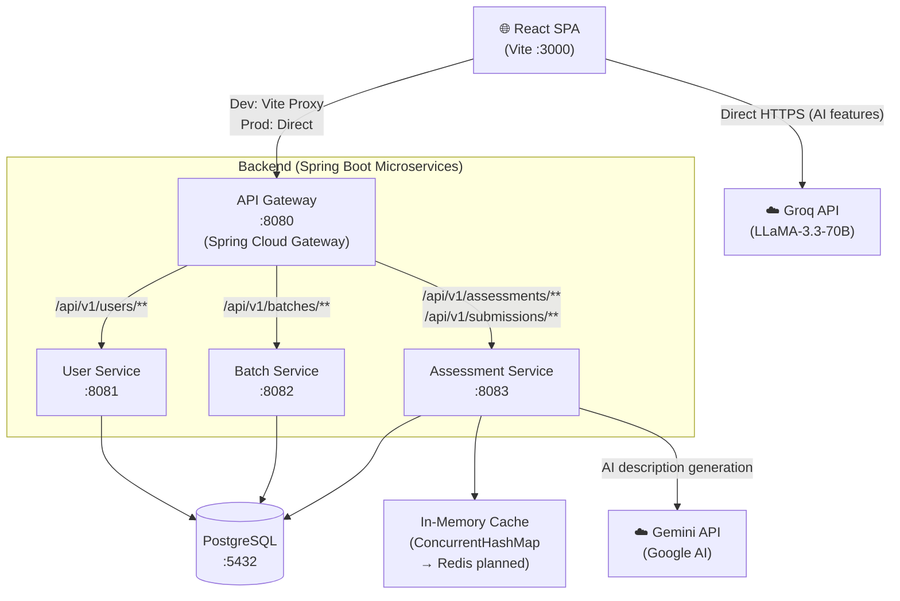
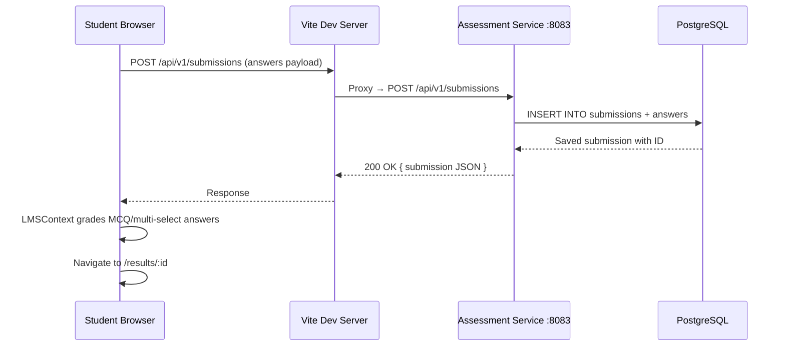
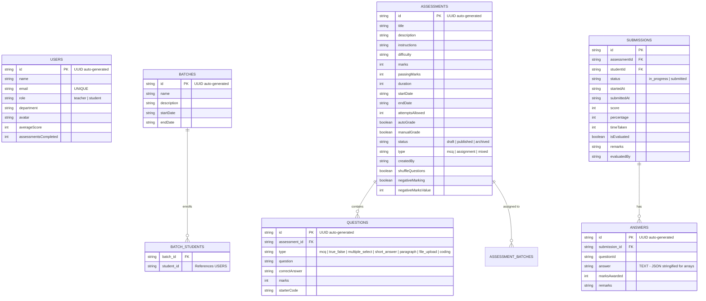
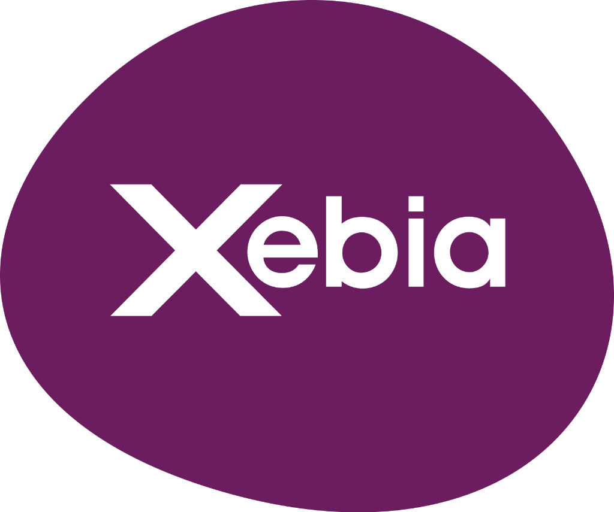

# 🎓 Xebia LMS — Learning Management System

> **An enterprise-grade, AI-powered Learning Management System for trainers and students — built with React 19, Spring Boot 4, and PostgreSQL.**

[](https://react.dev)
[](https://vitejs.dev)
[](https://spring.io/projects/spring-boot)
[](https://adoptium.net)
[](https://www.postgresql.org)
[](https://tailwindcss.com)
[](LICENSE)
[](https://github.com/mritunjai-prog/Xebia-Student-Trainer/commits)

Xebia LMS is a full-stack, microservices-based learning management platform designed for enterprise training programs. It enables **trainers** to build, publish, and evaluate assessments with AI assistance, while **students** can take quizzes, submit coding challenges, track their progress, and earn verifiable certificates — all from a single, beautifully designed interface.

---

## 📋 Table of Contents

- [Demo / Preview](#-demo--preview)
- [Features](#-features)
- [Tech Stack](#-tech-stack)
- [Project Architecture](#-project-architecture)
- [Getting Started / Installation](#-getting-started--installation)
- [API Documentation](#-api-documentation)
- [Database Schema](#-database-schema)
- [Folder-by-Folder Breakdown](#-folder-by-folder-breakdown)
- [Testing](#-testing)
- [Deployment](#-deployment)
- [Roadmap](#-roadmap)
- [Contributing](#-contributing)
- [Contributors](#-contributors)
- [License](#-license)
- [Acknowledgements / Credits](#-acknowledgements--credits)

---

## 🖼️ Demo / Preview

> **[TODO: Add live deployment URL here]**

| Screenshot | Description |
|---|---|
|  | **Login Page** — Role-based login with animated glassmorphism UI, dark/light mode, and quick-login shortcuts for demo accounts |
|  | **Trainer Dashboard** — Overview of active batches, published assessments, pending evaluations, and leaderboard stats |
|  | **AI Assessment Builder** — 3-panel enterprise builder with AI question generation (Groq/LLaMA), manual question input, and live preview |
|  | **Student Dashboard** — Upcoming assessments, completion history, and score tracking |
|  | **Quiz Interface** — Full-screen timed quiz with MCQ, true/false, multi-select, short-answer, and file-upload question types |
|  | **Coding Challenge** — Monaco Editor with AI-powered code execution simulation, multi-language support, and AI debug assistant |
|  | **Certificate of Completion** — Branded, printable certificate with QR verification, gold laurel badge, and PDF download |
|  | **Trainer Evaluation Panel** — Manual grading with per-question mark override, AI-suggested scores, and overall remarks |

---

## ✨ Features

### Implemented Features

**Trainer / Educator**
- ✅ Role-based authentication (trainer vs. student)
- ✅ Trainer dashboard with KPI cards (batches, assessments, pending evaluations)
- ✅ Batch creation, management, and student assignment
- ✅ Enterprise Assessment Builder (3-panel: Config → Questions → Preview)
- ✅ AI question generation via Groq LLaMA-3.3-70B (MCQ, true/false, coding, etc.)
- ✅ Excel / XLSX bulk question import with AI parsing
- ✅ Manual question builder with rich question types
- ✅ Assessment configuration: duration, dates, passing threshold, negative marking, shuffle, auto-submit
- ✅ Assessment publishing/archiving workflow (draft → published → archived)
- ✅ Manual evaluation panel with per-question mark override
- ✅ AI-suggested scores for subjective answers (short answer, paragraph)
- ✅ Overall remarks and evaluation finalization
- ✅ Reports page with charts (Recharts) — score distribution, batch performance
- ✅ Global leaderboard with student rankings
- ✅ Dark / Light theme toggle

**Student / Learner**
- ✅ Student dashboard with enrolled batches, upcoming assessments, and score history
- ✅ Full-screen timed quiz with auto-submit on timeout
- ✅ Question types: MCQ, True/False, Multiple-Select, Short Answer, Paragraph, File Upload
- ✅ Coding challenge interface with Monaco Editor
- ✅ Multi-language code support (JavaScript, Python, Java, C++)
- ✅ AI-powered code execution simulation (test case runner)
- ✅ AI debug assistant ("Why is my code failing?")
- ✅ Auto-save draft during quiz (server-side via in-memory cache)
- ✅ Results page with per-question breakdown and correct answer reveal
- ✅ Certificate of Completion (auto-generated on passing threshold)
- ✅ Certificate features: Xebia branding, QR code verification, gold laurel badge, PDF print/download

### Planned / In-Progress Features
- 🚧 Redis integration for production-grade draft caching (currently uses ConcurrentHashMap)
- 🚧 JWT-based authentication (currently session is stored in localStorage)
- 🚧 Real code execution engine (currently simulated via Groq AI)
- 🚧 File upload storage backend (currently UI stub only)
- 🚧 Email notifications for assessment scheduling
- 🚧 Spring Cloud API Gateway routing (configured but not fully deployed)
- 🚧 Containerisation with Docker Compose
- 🚧 Prometheus / Grafana monitoring

---

## 🛠️ Tech Stack

| Layer | Technology | Version | Purpose |
|---|---|---|---|
| **Frontend Framework** | React | 19.0.1 | UI rendering and component architecture |
| **Build Tool** | Vite | 6.2.3 | HMR dev server, production bundling |
| **Styling** | Tailwind CSS | 4.1.14 | Utility-first styling with dark mode |
| **Animation** | Motion (Framer Motion) | 12.23 | Page transitions and micro-animations |
| **Routing** | React Router DOM | 7.18 | Client-side SPA routing |
| **Charts** | Recharts | 3.9.2 | Dashboard analytics and score charts |
| **Code Editor** | Monaco Editor | 4.7.0 | VS Code-grade in-browser code editor |
| **Icons** | Lucide React | 0.546.0 | Icon library |
| **Markdown** | React Markdown | 10.1.0 | Render AI-generated markdown content |
| **Excel** | SheetJS (xlsx) | 0.18.5 | Parse uploaded Excel question files |
| **AI (Frontend)** | Groq API (LLaMA-3.3-70B) | — | Question generation, code eval, AI grading |
| **AI (Backend)** | Google Gemini API | ^2.4.0 | Server-side AI description generation |
| **Backend Framework** | Spring Boot | 4.1.0 | Microservices REST API framework |
| **Java Version** | OpenJDK | 21 | Backend runtime (LTS) |
| **ORM** | Spring Data JPA + Hibernate | — | Database access and schema management |
| **Validation** | Spring Boot Validation | — | Request body validation |
| **API Gateway** | Spring Cloud Gateway (MVC) | 2025.1.2 | Central routing across microservices |
| **Database** | PostgreSQL | 15+ | Primary relational database |
| **Caching** | In-memory ConcurrentHashMap (→ Redis) | — | Draft auto-save during exams |
| **Code Reduction** | Lombok | — | Boilerplate elimination in Java models |
| **Build System** | Maven Wrapper (mvnw) | — | Java build and dependency management |

> **Why this stack?** Spring Boot microservices provide independently deployable, loosely coupled services — ideal for an enterprise LMS where the user, batch, and assessment domains can scale independently. React 19 with Vite delivers a fast, modern DX with excellent HMR. Groq's LLaMA-3.3-70B is used for low-latency AI features, making question generation feel instant.

---

## 🏗️ Project Architecture

### High-Level Overview

The frontend is a React SPA served by Vite on **port 3000**. All API calls are prefixed `/api/v1/` and proxied by Vite (in development) to the appropriate microservice. In production, the **Spring Cloud API Gateway** on **port 8080** handles routing.

Three Spring Boot microservices each own their domain:
- **User Service** (`:8081`) — users (teachers, students)
- **Batch Service** (`:8082`) — training batches and enrollments
- **Assessment Service** (`:8083`) — assessments, questions, submissions, drafts, AI

All three services connect to a shared **PostgreSQL** database and use **Hibernate DDL auto-update** to manage their own tables.



### Request Flow — Submitting a Quiz



### Folder Structure

```
Xebia-Student-Trainer/
├── src/                          # React frontend source
│   ├── api/
│   │   └── client.js             # All HTTP calls to backend (users, batches, assessments, submissions, drafts)
│   ├── components/
│   │   ├── Header.jsx            # Top navigation bar with notifications and user profile
│   │   ├── Sidebar.jsx           # Left navigation with role-based menu items
│   │   ├── Toast.jsx             # Lightweight toast notification system
│   │   ├── assessment-builder/
│   │   │   ├── ConfigPanel.jsx   # Assessment configuration form (dates, marks, rules)
│   │   │   ├── EnterpriseBuilderLayout.jsx  # 3-panel builder shell and orchestration
│   │   │   ├── PreviewAIPanel.jsx           # Live question preview panel
│   │   │   └── QuestionBuilderPanel.jsx     # Manual + AI question creation panel
│   │   └── ui/
│   │       └── DateTimePicker.jsx           # Custom date/time picker component
│   ├── context/
│   │   └── LMSContext.jsx        # Global state (React Context) — users, batches, assessments, submissions, auth, grading logic
│   ├── data/                     # (Static seed data, if any)
│   ├── pages/
│   │   ├── AssessmentBuilder.jsx # Full-page builder wrapping EnterpriseBuilderLayout
│   │   ├── AssessmentDetail.jsx  # Trainer view of a single published assessment
│   │   ├── BatchDetail.jsx       # Detailed batch view with student list and assessment assignment
│   │   ├── BatchManagement.jsx   # Trainer batch management with CRUD
│   │   ├── CertificateView.jsx   # Printable completion certificate with QR code
│   │   ├── Evaluation.jsx        # Trainer manual evaluation and grading interface
│   │   ├── Leaderboard.jsx       # Global student leaderboard
│   │   ├── Login.jsx             # Role-based login with animated background
│   │   ├── Reports.jsx           # Analytics charts and batch performance reports
│   │   ├── Results.jsx           # Student quiz results breakdown page
│   │   ├── Settings.jsx          # User settings (theme, profile, notifications)
│   │   ├── StudentAssessments.jsx # Student assessment listing and enrollment view
│   │   ├── StudentDashboard.jsx  # Student home dashboard
│   │   ├── TakeCoding.jsx        # Full coding challenge interface with Monaco Editor + AI
│   │   ├── TakeQuiz.jsx          # Full quiz-taking interface with timer and auto-submit
│   │   └── TeacherDashboard.jsx  # Trainer home dashboard with KPIs
│   ├── utils/
│   │   └── aiService.js          # Groq API wrapper (generate questions, eval code, debug code, parse Excel)
│   ├── App.jsx                   # Root app, routing, layout shell
│   ├── index.css                 # Global CSS and Tailwind base
│   └── main.jsx                  # React 19 app entry point
│
├── backend/                      # All Java Spring Boot microservices
│   ├── api-gateway/              # Spring Cloud Gateway — central routing (:8080)
│   ├── user-service/             # User CRUD REST API (:8081)
│   ├── batch-service/            # Batch CRUD REST API (:8082)
│   ├── assessment-service/       # Assessment, Question, Submission, Draft, AI REST API (:8083)
│   └── start_backend.ps1         # PowerShell script to launch all 4 services simultaneously
│
├── public/                       # Static assets served by Vite
│   ├── logo-light.png            # Xebia logo (purple blob, white text) — used in certificates and header
│   └── logo-dark.png             # Xebia logo (flat purple wordmark on white)
│
├── .env                          # Local environment variables (never commit)
├── .env.example                  # Environment variable template
├── vite.config.js                # Vite config with API proxy rules
├── package.json                  # Frontend dependencies and npm scripts
├── index.html                    # HTML entry point for Vite
├── create_accounts.js            # Utility script: seed default trainer and student accounts
└── remove_dummy_data.py          # Utility script: clean up test data from the database
```

---

## 🚀 Getting Started / Installation

### Prerequisites

Ensure the following tools are installed before proceeding:

| Tool | Version | Download |
|---|---|---|
| Node.js | >= 18.x (LTS recommended) | [nodejs.org](https://nodejs.org) |
| npm | >= 9.x (comes with Node) | Included with Node.js |
| Java (JDK) | 21 (LTS) | [Adoptium](https://adoptium.net/temurin/releases/) |
| PostgreSQL | 15+ | [postgresql.org](https://www.postgresql.org/download/) |
| Git | Any modern version | [git-scm.com](https://git-scm.com) |

> **Optional:** Redis (for production-grade draft caching — currently falls back to in-memory store)

---

### 1. Clone the Repository

```bash
git clone https://github.com/mritunjai-prog/Xebia-Student-Trainer.git
cd Xebia-Student-Trainer
```

---

### 2. Configure Environment Variables

```bash
# Copy the example file
cp .env.example .env
```

Open `.env` and fill in the required values:

```env
GEMINI_API_KEY="your-google-gemini-api-key-here"
APP_URL="http://localhost:3000"
VITE_GROQ_API_KEY="your-groq-api-key-here"
```

<details>
<summary>📄 Full Environment Variable Reference</summary>

| Variable | Required | Description | Example Value |
|---|---|---|---|
| `GEMINI_API_KEY` | Yes | Google Gemini API key for server-side AI description generation | `AIzaSy...` |
| `VITE_GROQ_API_KEY` | Yes | Groq API key for frontend AI features (question gen, code eval) | `gsk_...` |
| `APP_URL` | Yes | The base URL of the running application (used for links/callbacks) | `http://localhost:3000` |

> 🔑 **Groq API key** is used directly from the browser. Get a free key at [console.groq.com](https://console.groq.com).
> 🔑 **Gemini API key** is used by the backend assessment service. Get one at [aistudio.google.com](https://aistudio.google.com).

</details>

---

### 3. Database Setup

Ensure PostgreSQL is running on port `5432`. The default configuration uses the `postgres` database.

```bash
# Connect to PostgreSQL
psql -U postgres

# The services use ddl-auto: update, so tables are created automatically on first start.
# No manual migration is needed.
```

> ⚠️ **The database password** is currently hardcoded in each service's `application.yml` as `Hanusuman11!`.
> Update the password in all four `application.yml` files before running in any shared environment:
> - `backend/user-service/src/main/resources/application.yml`
> - `backend/batch-service/src/main/resources/application.yml`
> - `backend/assessment-service/src/main/resources/application.yml`

**Seed default accounts** (trainer + student) after the backend is running for the first time:

```bash
node create_accounts.js
```

---

### 4. Install Frontend Dependencies

```bash
npm install
```

---

### 5. Start the Backend Services

All four Spring Boot services must be running. Use the provided PowerShell script:

```powershell
# From the project root — opens 4 separate terminal windows
cd backend
.\start_backend.ps1
```

Or start each service individually:

```bash
# Terminal 1 — API Gateway (port 8080)
cd backend/api-gateway
./mvnw spring-boot:run

# Terminal 2 — User Service (port 8081)
cd backend/user-service
./mvnw spring-boot:run

# Terminal 3 — Batch Service (port 8082)
cd backend/batch-service
./mvnw spring-boot:run

# Terminal 4 — Assessment Service (port 8083)
cd backend/assessment-service
./mvnw spring-boot:run
```

> ⏱️ First startup takes longer as Maven downloads dependencies. Subsequent starts are fast.

---

### 6. Start the Frontend Dev Server

```bash
npm run dev
```

The application will be available at: **http://localhost:3000**

---

### 7. Verify Everything is Working

1. Open **http://localhost:3000** — you should see the animated Xebia login page.
2. The console should show successful API connections (no red 500 errors).
3. Use the **Quick Login** buttons to log in as:
   - **Trainer:** `trainer@xebia.com`
   - **Student:** `student@xebia.com`
4. Check backend health by hitting: `http://localhost:8081/api/v1/users` — you should get a JSON array.

---

## 📡 API Documentation

All endpoints are prefixed with `/api/v1`. In development, requests go through the Vite proxy on `:3000`. In production, they route through the API Gateway on `:8080`.

<details>
<summary>👤 User Service — <code>:8081</code></summary>

| Method | Route | Description | Auth | Request Body | Response |
|---|---|---|---|---|---|
| `GET` | `/api/v1/users` | Get all users (optionally filter by `?role=student` or `?role=teacher`) | None | — | `[{id, name, email, role, department, ...}]` |
| `POST` | `/api/v1/users` | Create a new user | None | `{name, email, role, department}` | `{id, name, email, role, ...}` |

</details>

<details>
<summary>📦 Batch Service — <code>:8082</code></summary>

| Method | Route | Description | Auth | Request Body | Response |
|---|---|---|---|---|---|
| `GET` | `/api/v1/batches` | Get all batches | None | — | `[{id, name, description, students: [...ids], ...}]` |
| `POST` | `/api/v1/batches` | Create a new batch | None | `{name, description, startDate, endDate}` | `{id, name, ...}` |
| `PUT` | `/api/v1/batches/{id}` | Update a batch (including adding students) | None | `{name, students: [...ids], ...}` | `{id, name, ...}` |
| `DELETE` | `/api/v1/batches/{id}` | Delete a batch | None | — | `204 No Content` |

</details>

<details>
<summary>📝 Assessment Service — <code>:8083</code></summary>

**Assessments**

| Method | Route | Description | Auth | Request Body | Response |
|---|---|---|---|---|---|
| `GET` | `/api/v1/assessments` | Get all assessments | None | — | `[{id, title, questions: [...], ...}]` |
| `POST` | `/api/v1/assessments` | Create a new assessment with questions | None | `{title, description, questions, duration, passingMarks, ...}` | `{id, title, ...}` |
| `PUT` | `/api/v1/assessments/{id}` | Update an existing assessment | None | Full assessment object | `{id, title, ...}` |
| `DELETE` | `/api/v1/assessments/{id}` | Delete an assessment | None | — | `204 No Content` |

**Submissions**

| Method | Route | Description | Auth | Request Body | Response |
|---|---|---|---|---|---|
| `GET` | `/api/v1/submissions` | Get all submissions (optionally filter by `?studentId=...`) | None | — | `[{id, assessmentId, studentId, answers, score, ...}]` |
| `POST` | `/api/v1/submissions` | Submit a student's completed assessment | None | `{id, assessmentId, studentId, answers: [{questionId, answer}], ...}` | `{id, ...}` |

**Draft Auto-Save (In-Memory)**

| Method | Route | Description | Auth | Request Body | Response |
|---|---|---|---|---|---|
| `POST` | `/api/v1/assessments/drafts/{studentId}/{assessmentId}` | Save an in-progress quiz draft | None | `{answers: {...}, currentIndex: 0, ...}` | `204 No Content` |
| `GET` | `/api/v1/assessments/drafts/{studentId}/{assessmentId}` | Retrieve a saved draft | None | — | Draft object or `null` |

**AI Generation (Backend)**

| Method | Route | Description | Auth | Request Body | Response |
|---|---|---|---|---|---|
| `POST` | `/api/v1/assessments/ai/generate-description` | Generate an assessment description using Gemini AI | None | `{topic: "Java Inheritance"}` | `{description: "..."}` |

</details>

---

## 🗄️ Database Schema

All services share a single PostgreSQL database (`postgres`). Tables are created automatically by Hibernate on startup.



---

## 📂 Folder-by-Folder Breakdown

### `src/context/LMSContext.jsx`
The **brain of the frontend**. This is a React Context provider that manages all global application state. Key responsibilities:
- **Bootstrapping**: On mount, fetches all users, batches, assessments, and submissions from the backend and stores them in React state.
- **Session**: Reads/writes the logged-in user from `localStorage` (key: `session`).
- **Auth**: `login(email, role)` function matches credentials against the fetched users list.
- **Business Logic**: Contains the auto-grading engine (`submitAssessment`) that resolves MCQ answer indices to option text before comparing to `correctAnswer`, handles negative marking, and calculates `score` and `percentage`.
- **Trainer Actions**: `evaluateSubmission()` for manual grading overrides.
- **State sync**: Persists coding submissions, leaderboard, and notifications to `localStorage` for offline resilience.

### `src/utils/aiService.js`
A wrapper around the **Groq REST API** (LLaMA-3.3-70B model). Exports:
- `generateAssessmentDescription(title, subject, difficulty)` — 2-3 sentence description
- `generateQuestions(topic, count, taxonomy, type)` — returns a JSON array of questions
- `evaluateSubmission(question, answer, maxMarks, type, correctAnswer)` — AI grading for subjective answers
- `evaluateCodeExecution(code, language, problem, testCases)` — simulates code running against test cases
- `evaluateFinalSubmission(code, language, problem, testCases, maxMarks)` — grading for coding submissions
- `debugCodeWithAI(code, language, problem, logs)` — "AI Tutor" hint for debugging
- `parseExcelToQuestions(rawJson)` — converts parsed Excel rows into the question schema

All functions include fallback responses so the UI never breaks if the API is down.

### `src/pages/TakeCoding.jsx`
The most complex frontend file (~59KB). Renders a full-screen HackerRank-style coding environment:
- Monaco Editor with language selection
- Console output panel
- Test case results panel (public + hidden)
- Custom input runner
- AI Debug button
- Timer and auto-submit logic

### `src/pages/CertificateView.jsx`
Generates a branded, printable certificate. Features:
- Xebia logo (`/public/logo-light.png`)
- Tranquil Velvet (`#6C1D5F`) and Gold (`#C9A84C`) brand colors
- Cinzel, EB Garamond, Dancing Script, and Lato Google Fonts
- Deterministic SVG QR code based on Certificate ID
- Gold SVG laurel wreath badge
- Decorative purple/gold bottom arch
- CSS print media query for PDF generation

### `backend/assessment-service/`
The most feature-rich microservice. Contains four controllers:
- `AssessmentController` — CRUD for assessments
- `SubmissionController` — CRUD for submissions and answers
- `DraftController` — In-memory draft save/retrieve
- `AIController` — Proxies AI description generation requests to Gemini

### `backend/api-gateway/`
A **Spring Cloud Gateway** (MVC mode) that routes incoming requests by path prefix to the correct downstream service. Configured in `application.yml` — no Java code is needed for basic routing.

---

## 🧪 Testing

### Current Test Coverage

| Service | Unit Tests | Integration Tests | Status |
|---|---|---|---|
| user-service | None | None | ⚠️ Not written |
| batch-service | None | None | ⚠️ Not written |
| assessment-service | None | None | ⚠️ Not written |
| Frontend (React) | None | None | ⚠️ Not written |

> All four Spring Boot services have the JPA, Validation, and WebMVC test starter dependencies declared in their `pom.xml`, indicating tests are planned but not yet implemented.

### How to Run Tests (When Available)

**Backend (per service):**
```bash
cd backend/user-service
./mvnw test

cd backend/assessment-service
./mvnw test
```

**Frontend:**
```bash
# Vitest is not yet configured. To add it:
npm install --save-dev vitest @testing-library/react
npx vitest run
```

---

## 🚢 Deployment

> 🚧 **Deployment (Coming Soon)**
>
> Containerization and CI/CD are planned. The architecture is deployment-ready with the following target configuration:

| Component | Planned Platform |
|---|---|
| Frontend (React/Vite) | [TODO: Vercel / Nginx / Cloud Run] |
| API Gateway | [TODO: Cloud Run / EC2 / K8s] |
| User Service | [TODO: Cloud Run / EC2 / K8s] |
| Batch Service | [TODO: Cloud Run / EC2 / K8s] |
| Assessment Service | [TODO: Cloud Run / EC2 / K8s] |
| Database | [TODO: Cloud SQL (PostgreSQL) / RDS] |
| Caching | [TODO: Redis (Memorystore / ElastiCache)] |

**Production Build (Frontend):**
```bash
npm run build
# Output: ./dist/ — serve this with any static file server or CDN
```

**Production Packaging (Backend):**
```bash
cd backend/user-service
./mvnw package -DskipTests
# Output: target/user-service-0.0.1-SNAPSHOT.jar
java -jar target/user-service-0.0.1-SNAPSHOT.jar
```

---

## 🗺️ Roadmap

- [x] Role-based authentication (trainer / student)
- [x] Trainer dashboard with KPIs
- [x] Batch management (CRUD, student enrollment)
- [x] AI-powered Assessment Builder (Groq + LLaMA-3.3)
- [x] Excel question import with AI parsing
- [x] Quiz-taking interface (MCQ, true/false, multi-select, short-answer)
- [x] Coding challenge interface (Monaco Editor + AI simulation)
- [x] Auto-grading engine with negative marking support
- [x] Manual evaluation panel with AI scoring suggestions
- [x] Draft auto-save during quiz sessions
- [x] Reports and analytics with charts
- [x] Global leaderboard
- [x] Certificate of Completion with QR code and PDF download
- [x] Dark / Light theme
- [x] Microservices architecture with Spring Cloud Gateway
- [ ] JWT authentication and Spring Security
- [ ] Redis integration for production draft caching
- [ ] Real code execution engine (Docker sandbox or Judge0)
- [ ] Email notifications for assessment scheduling
- [ ] Docker Compose for one-command local setup
- [ ] CI/CD pipeline (GitHub Actions)
- [ ] Prometheus + Grafana monitoring
- [ ] Student peer review feature
- [ ] Mobile-responsive quiz interface

---

## 🤝 Contributing

We welcome contributions from the community! Please follow these guidelines to keep the codebase consistent and high-quality.

### Branch Naming Convention

```
feature/<short-description>     # New features
fix/<short-description>         # Bug fixes
chore/<short-description>       # Tooling, deps, refactors
docs/<short-description>        # Documentation only changes
```

**Example:** `feature/redis-draft-caching`, `fix/mcq-grading-index-bug`

### Commit Message Style

Follow [Conventional Commits](https://www.conventionalcommits.org/):

```
<type>(<scope>): <short description>

feat(assessment): add negative marking support to grading engine
fix(certificate): resolve scrolling bug in certificate page
docs(readme): add API documentation section
chore(deps): upgrade React to 19.0.1
```

**Types:** `feat`, `fix`, `docs`, `style`, `refactor`, `test`, `chore`

### Submitting a Pull Request

1. Fork the repository
2. Create a branch from `main` following the naming convention above
3. Make your changes, ensuring all existing features still work
4. Write or update tests if applicable
5. Submit a PR against the `main` branch with a clear title and description
6. Reference any related issues with `Closes #<issue-number>`

### Coding Standards

**Frontend (JavaScript/React):**
- Use functional components with hooks — no class components
- Keep components focused on a single responsibility
- Use `LMSContext` for shared state; avoid prop-drilling more than 2 levels
- All API calls must go through `src/api/client.js`
- Use Tailwind utility classes; avoid inline styles except for dynamic values

**Backend (Java/Spring Boot):**
- Use Lombok `@Data`, `@NoArgsConstructor`, `@AllArgsConstructor` on entities
- Keep controllers thin — business logic belongs in service classes
- Use `@CrossOrigin(origins = "*")` on all controllers for CORS
- Follow standard Spring layering: Controller → Service → Repository

### Code of Conduct

This project follows a standard open-source Code of Conduct. Be respectful, inclusive, and constructive in all interactions.

---

## 👥 Contributors

<table>
  <tr>
    <td align="center">
      <a href="https://github.com/mritunjai-prog">
        <br />
        <sub><b>mritunjai-prog</b></sub>
      </a><br />
      <sub>Lead Developer</sub>
    </td>
    <!-- Add more contributors here using the same block -->
  </tr>
</table>

> Want to appear here? Make a meaningful contribution and submit a PR!

---

## 📄 License

**License to be decided.**

> [TODO: Add a `LICENSE` file to the repository root. Common choices for an enterprise internal tool: MIT, Apache 2.0, or a proprietary license.]

---

## 🙏 Acknowledgements / Credits

- **[Groq](https://groq.com)** — Ultra-fast LLaMA-3.3-70B inference API used for all frontend AI features
- **[Google Gemini](https://aistudio.google.com)** — Used for server-side AI description generation
- **[Monaco Editor](https://microsoft.github.io/monaco-editor/)** — The same editor that powers VS Code, embedded in the coding challenge interface
- **[Recharts](https://recharts.org)** — Composable charting library for all dashboard analytics
- **[Lucide Icons](https://lucide.dev)** — Beautiful, consistent open-source icon set
- **[Motion (Framer Motion)](https://motion.dev)** — Production-ready animation library for React
- **[SheetJS (xlsx)](https://sheetjs.com)** — Excel parsing library for question bulk import
- **[Spring Cloud Gateway](https://spring.io/projects/spring-cloud-gateway)** — API gateway routing solution
- **[Lombok](https://projectlombok.org)** — Java boilerplate elimination
- **[Tailwind CSS](https://tailwindcss.com)** — Utility-first CSS framework
- **[Google Fonts](https://fonts.google.com)** — Cinzel, EB Garamond, Dancing Script, and Lato used in certificate design
- **[shields.io](https://shields.io)** — Badges in this README

---

<div align="center">
  
  <br/>
  <sub>Built with ❤️ by the Xebia team</sub>
</div>
